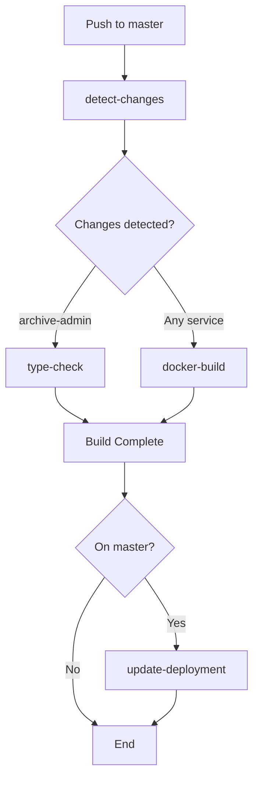

# GitHub Workflows

This directory contains CI/CD workflows for the BGCE Archive project.

## Workflow Architecture

```
┌─────────────────────────────────────────────────────────────┐
│                    build-and-push.yml                       │
│                   (Main Orchestrator)                       │
└─────────────────────────────────────────────────────────────┘
                            │
        ┌───────────────────┼───────────────────┐
        │                   │                   │
        ▼                   ▼                   ▼
┌──────────────┐   ┌──────────────┐   ┌──────────────┐
│ type-check   │   │ docker-build │   │ update-k8s   │
│   .yml       │   │    .yml      │   │    .yml      │
└──────────────┘   └──────────────┘   └──────────────┘
        │                   │                   │
        │                   │                   │
        ▼                   ▼                   ▼
┌──────────────┐   ┌──────────────┐   ┌──────────────┐
│ node-setup   │   │ docker-login │   │   kubectl    │
│   action     │   │   action     │   │   commands   │
└──────────────┘   └──────────────┘   └──────────────┘
                           │
                           ▼
                   ┌──────────────┐
                   │docker-metadata│
                   │   action     │
                   └──────────────┘
```

## Workflows Overview

### 🚀 Main Workflows

| Workflow | Type | Purpose | Triggers |
|----------|------|---------|----------|
| `build-and-push.yml` | Orchestrator | Main CI/CD pipeline | Push, PR, Tags |
| `commit-lint.yml` | Standalone | Validate commit messages | Push, PR |
| `docs.yml` | Standalone | Build documentation | Push to docs |
| `go-tests.yml` | Standalone | Run Go tests | Push, PR |

### 🔄 Reusable Workflows

| Workflow | Purpose | Called By | Status |
|----------|---------|-----------|--------|
| `type-check.yml` | TypeScript type checking | build-and-push | ✅ Active |
| `docker-build.yml` | Build & push Docker images | build-and-push | ✅ Active |
| `update-k8s.yml` | Update K8s deployments | build-and-push | 🚧 Ready (disabled) |

---

## Detailed Workflow Documentation

### 🚀 build-and-push.yml
**Main orchestrator workflow** - Coordinates the entire CI/CD pipeline.

**Triggers:**
- Push to `master`/`main` branches
- Pull requests to `master`/`main`
- Version tags (`v*.*.*`)

**Environment Variables:**
```yaml
REGISTRY_GHCR: ghcr.io
IMAGE_PREFIX: nesohq/bgce-archive
```

**Jobs:**

#### 1. `detect-changes`
Detects which services have changed using path filters.

**Outputs:**
- `archive-admin`: true/false
- `archive-client`: true/false
- `cortex`: true/false
- `postal`: true/false

**Path Filters:**
```yaml
archive-admin: 'archive-admin/**'
archive-client: 'archive-client/**'
cortex: 'cortex/**'
postal: 'postal/**'
```

#### 2. `type-check`
Runs TypeScript type checking for archive-admin (if changed).

**Calls:** `type-check.yml` reusable workflow

**Condition:** Only runs if `archive-admin` changed

#### 3. `build-and-push`
Builds and pushes Docker images for all services.

**Calls:** `docker-build.yml` reusable workflow

**Matrix:** All 4 services (archive-admin, archive-client, cortex, postal)

**Condition:** Only runs on push (not PR)

**Features:**
- Multi-platform builds (linux/amd64, linux/arm64)
- GitHub Actions cache for faster builds
- Automatic tagging (branch, sha, latest, semver)
- Pushes to GitHub Container Registry

#### 4. `update-deployment`
Updates Kubernetes deployment manifests (currently disabled).

**Status:** 🚧 Shows status message until infra repo is ready

**When Enabled:** Will call `update-k8s.yml` reusable workflow

**Condition:** Only runs on master branch (not PR)

---

### � type-check.yml
**Reusable workflow** for TypeScript type checking.

**Inputs:**
```yaml
service:
  required: true
  type: string
  description: 'Service name to type check'
```

**Steps:**
1. 📥 Checkout code
2. 📦 Setup Node.js with Yarn (uses `node-setup` action)
3. � Run type check (`yarn type-check`)

**Features:**
- Uses custom `node-setup` action for caching
- Continues on error (doesn't fail build)
- Frozen lockfile for reproducible builds

**Example Usage:**
```yaml
jobs:
  check:
    uses: ./.github/workflows/type-check.yml
    with:
      service: archive-admin
```

---

### 🐳 docker-build.yml
**Reusable workflow** for building and pushing Docker images.

**Inputs:**
```yaml
service:
  required: true
  type: string
  description: 'Service name to build'
should-build:
  required: true
  type: boolean
  description: 'Whether to build this service'
```

**Secrets:**
```yaml
DOCKERHUB_USERNAME: (optional)
DOCKERHUB_TOKEN: (optional)
```

**Steps:**
1. 📥 Checkout code
2. 🔧 Setup Docker Buildx
3. 🔐 Login to registries (uses `docker-login` action)
4. 🏷️ Extract metadata (uses `docker-metadata` action)
5. 🐳 Build and push multi-platform image
6. 📝 Generate image summary

**Features:**
- Multi-platform builds (amd64 + arm64)
- GitHub Actions cache (type=gha)
- Automatic tagging strategy
- Optional Docker Hub push
- Detailed build summaries

**Generated Tags:**
- `branch-name` (e.g., `master`)
- `pr-123` (for pull requests)
- `v1.2.3` (for semver tags)
- `v1.2` (major.minor)
- `v1` (major only)
- `master-abc123` (branch + sha)
- `latest` (for default branch)

**Example Usage:**
```yaml
jobs:
  build:
    uses: ./.github/workflows/docker-build.yml
    with:
      service: cortex
      should-build: true
    secrets: inherit
```

---

### ☸️ update-k8s.yml
**Reusable workflow** for updating Kubernetes deployments.

**Status:** 🚧 Ready but disabled until infra repo is set up

**Inputs:**
```yaml
service:
  required: true
  type: string
  description: 'Service name to update'
should-update:
  required: true
  type: boolean
  description: 'Whether to update this service'
```

**Secrets:**
```yaml
INFRA_REPO_TOKEN:
  required: true
  description: 'Token for infra repository access'
```

**Steps:**
1. 📥 Checkout infra repository
2. 📝 Update deployment manifest (or create if new)
3. 💾 Commit and push changes

**Features:**
- Automatic manifest creation for new services
- Updates existing manifests with new image tags
- Uses SHA-based image tags for traceability
- Commits with descriptive messages

**Generated Deployment:**
```yaml
apiVersion: apps/v1
kind: Deployment
metadata:
  name: {service}
  labels:
    app: {service}
spec:
  replicas: 1
  selector:
    matchLabels:
      app: {service}
  template:
    metadata:
      labels:
        app: {service}
    spec:
      containers:
      - name: {service}
        image: ghcr.io/nesohq/bgce-archive/{service}:{sha}
        imagePullPolicy: Always
```

**To Enable:**
1. Set up infra repository
2. Add `INFRA_REPO_TOKEN` secret
3. Uncomment in `build-and-push.yml`
4. Remove temporary status message

**Example Usage:**
```yaml
jobs:
  deploy:
    uses: ./.github/workflows/update-k8s.yml
    with:
      service: cortex
      should-update: true
    secrets: inherit
```

---

### 📝 commit-lint.yml
Validates commit messages follow [Conventional Commits](https://www.conventionalcommits.org/).

**Triggers:**
- Push to any branch
- Pull requests

**Valid Formats:**
- `feat: add new feature`
- `fix: resolve bug`
- `docs: update documentation`
- `chore: update dependencies`
- `refactor: restructure code`
- `test: add tests`
- `ci: update workflows`

---

### 🧪 go-tests.yml
Runs Go tests for backend services (cortex, postal).

**Triggers:**
- Push to Go service directories
- Pull requests affecting Go code

**Features:**
- Uses `go-cache` action for faster builds
- Runs tests with race detection
- Generates coverage reports

---

### 📚 docs.yml
Builds and deploys documentation using mdBook.

**Triggers:**
- Push to `docs/**` directory
- Manual workflow dispatch

**Features:**
- Uses `cargo-mdbook-cache` action
- Builds static documentation site
- Deploys to GitHub Pages (if configured)

---

## Custom Actions Used

All workflows leverage custom actions from `.github/actions/`:

| Action | Purpose | Used In |
|--------|---------|---------|
| 🔐 `docker-login` | Login to Docker registries | docker-build.yml |
| 🏷️ `docker-metadata` | Extract Docker metadata | docker-build.yml |
| 📦 `node-setup` | Setup Node.js with Yarn | type-check.yml |
| ♻️ `go-cache` | Cache Go modules | go-tests.yml |
| 📚 `cargo-mdbook-cache` | Cache Cargo and mdBook | docs.yml |

See [Actions README](../actions/README.md) for detailed documentation.

---

## Workflow Execution Flow



---

## Services Configuration

| Service | Language | Framework | Port | Docker Base |
|---------|----------|-----------|------|-------------|
| **archive-admin** | TypeScript | Vue 3 + Vite | 5173 | node:20-alpine |
| **archive-client** | TypeScript | Next.js 15 | 3000 | node:20-alpine |
| **cortex** | Go 1.23 | Fiber | 8080 | golang:1.23-alpine |
| **postal** | Go 1.23 | Fiber | 8081 | golang:1.23-alpine |

---

## Adding New Services

To add a new service to the pipeline:

### 1. Update `build-and-push.yml`

Add to `detect-changes` filters:
```yaml
filters: |
  my-service:
    - 'my-service/**'
```

Add to matrix:
```yaml
matrix:
  service: [archive-admin, archive-client, cortex, postal, my-service]
```

### 2. Create Dockerfile

Ensure your service has a `Dockerfile` in its root directory.

### 3. Add Type Checking (Optional)

If TypeScript service, add type-check job:
```yaml
type-check-my-service:
  needs: detect-changes
  if: needs.detect-changes.outputs.my-service == 'true'
  uses: ./.github/workflows/type-check.yml
  with:
    service: my-service
```

### 4. Test

Push changes and verify workflow runs correctly.

---

## Environment Variables

Common environment variables used across workflows:

```yaml
# Docker Registry
REGISTRY_GHCR: ghcr.io
IMAGE_PREFIX: nesohq/bgce-archive

# Versions
NODE_VERSION: '20'
GO_VERSION: '1.23'

# Paths
INFRA_REPO: managed-ops-preps/infra
```

---

## Secrets Configuration

| Secret | Purpose | Required | Where to Add |
|--------|---------|----------|--------------|
| `GITHUB_TOKEN` | Push to GHCR, checkout repos | ✅ Yes | Auto-provided by GitHub |
| `INFRA_REPO_TOKEN` | Update K8s manifests | ⏳ When K8s enabled | Settings → Secrets → Actions |
| `DOCKERHUB_USERNAME` | Push to Docker Hub | ❌ Optional | Settings → Secrets → Actions |
| `DOCKERHUB_TOKEN` | Push to Docker Hub | ❌ Optional | Settings → Secrets → Actions |

**To add secrets:**
1. Go to repository Settings
2. Click "Secrets and variables" → "Actions"
3. Click "New repository secret"
4. Add name and value

---

## Monitoring & Debugging

### View Workflow Runs
1. Go to **Actions** tab: https://github.com/nesohq/bgce-archive/actions
2. Click on a workflow to see all runs
3. Click on a run to see job details
4. Click on a job to see step-by-step logs

### Job Summaries
Each workflow generates detailed summaries with:
- 🐳 Docker images built and pushed
- 🏷️ Image tags generated
- 📝 Pull commands for easy deployment
- ⏳ Deployment status messages

### Common Issues

**❌ Workflow not triggering:**
- Check file is in `.github/workflows/`
- Verify YAML syntax: `yamllint workflow.yml`
- Check trigger conditions match your event
- Ensure branch name matches trigger

**❌ Type check fails:**
- Run `yarn type-check` locally first
- Check `yarn.lock` is committed
- Verify `tsconfig.json` is valid
- Check for missing type definitions

**❌ Docker build fails:**
- Check Dockerfile syntax
- Verify base image exists
- Check for missing dependencies
- Review build logs for specific errors

**❌ Docker push fails:**
- Verify `GITHUB_TOKEN` has `packages: write` permission
- Check registry URL is correct
- Ensure image name follows naming conventions
- Check if you're authenticated

**❌ Action not found:**
- Ensure path is correct: `./.github/actions/name`
- Check `action.yml` exists in action directory
- Verify action name matches directory name

**❌ Reusable workflow fails:**
- Check inputs are passed correctly
- Verify secrets are inherited with `secrets: inherit`
- Ensure workflow file is in `.github/workflows/`

---

## Performance Optimization

### Caching Strategy
- ✅ Docker layer caching (type=gha)
- ✅ Go modules caching
- ✅ Yarn dependencies caching
- ✅ Cargo binaries caching

### Build Time Optimization
- ✅ Change detection (only build what changed)
- ✅ Matrix parallelization (build services in parallel)
- ✅ Reusable workflows (avoid duplication)
- ✅ Multi-stage Docker builds

### Typical Build Times
- Type check: ~1-2 minutes
- Docker build (cached): ~2-3 minutes
- Docker build (no cache): ~5-10 minutes
- Full pipeline: ~5-15 minutes

---

## Best Practices

✅ **Use reusable workflows** for complete jobs with multiple steps
✅ **Use custom actions** for repeated 1-3 step sequences
✅ **Keep workflows focused** - one clear purpose per workflow
✅ **Add clear descriptions** - help future maintainers
✅ **Use emojis in logs** - makes scanning easier 🎯
✅ **Cache dependencies** - faster builds, lower costs
✅ **Use matrix strategies** - parallel execution for multiple services
✅ **Add job summaries** - better visibility in GitHub UI
✅ **Test locally** - use `act` to test before pushing
✅ **Document changes** - update READMEs when modifying workflows

---

## Testing Workflows Locally

Use [act](https://github.com/nektos/act) to test workflows locally:

```bash
# Install act
brew install act  # macOS
# or
curl https://raw.githubusercontent.com/nektos/act/master/install.sh | sudo bash

# List available workflows
act -l

# Run push event
act push

# Run specific job
act -j build-and-push

# Run with secrets
act -s GITHUB_TOKEN=your_token

# Dry run (don't execute)
act -n
```

---

## Troubleshooting Guide

### Build Failures

**"No space left on device":**
```bash
# Docker layer caching might be filling up
# Solution: Reduce image sizes or disable caching temporarily
```

**"go.mod: no such file or directory":**
```bash
# Working directory might be wrong
# Solution: Check working-directory in workflow
```

**"yarn: command not found":**
```bash
# Node.js setup might have failed
# Solution: Check node-setup action is used correctly
```

### Permission Issues

**"Resource not accessible by integration":**
```bash
# Token doesn't have required permissions
# Solution: Add permissions block to workflow:
permissions:
  contents: read
  packages: write
```

**"Authentication required":**
```bash
# Not logged in to registry
# Solution: Check docker-login action is called before build
```

### Workflow Syntax

**"Invalid workflow file":**
```bash
# YAML syntax error
# Solution: Validate with yamllint or GitHub's validator
```

**"Job 'x' depends on unknown job 'y'":**
```bash
# Job dependency doesn't exist
# Solution: Check needs: references correct job names
```

---

## Migration Guide

### From Old Workflow to New Structure

**Before (monolithic):**
```yaml
# 200+ lines in one file
jobs:
  build:
    steps:
      - name: Setup Node
        # ... many steps
      - name: Build Docker
        # ... many steps
      - name: Deploy
        # ... many steps
```

**After (modular):**
```yaml
# Main workflow (60 lines)
jobs:
  type-check:
    uses: ./.github/workflows/type-check.yml
  build:
    uses: ./.github/workflows/docker-build.yml
  deploy:
    uses: ./.github/workflows/update-k8s.yml
```

**Benefits:**
- 70% reduction in main workflow size
- 100% elimination of code duplication
- 4x increase in reusable components
- Much easier to maintain and test

---

## Future Enhancements

Planned improvements:

- [ ] Add security scanning (Trivy, Snyk)
- [ ] Add performance testing
- [ ] Add automated rollback on failure
- [ ] Add Slack/Discord notifications
- [ ] Add deployment previews for PRs
- [ ] Add automated changelog generation
- [ ] Add release automation

---

## Contributing

When modifying workflows:

1. **Test locally** with `act` if possible
2. **Update documentation** in this README
3. **Add clear commit messages** following conventional commits
4. **Test in a branch** before merging to master
5. **Review logs** after deployment to ensure success

---

## Resources

- 📖 [GitHub Actions Documentation](https://docs.github.com/en/actions)
- 🔧 [Actions README](../actions/README.md)
- 📚 [Reusable Workflows Guide](https://docs.github.com/en/actions/using-workflows/reusing-workflows)
- 🎯 [Composite Actions Guide](https://docs.github.com/en/actions/creating-actions/creating-a-composite-action)
- 🐳 [Docker Build Push Action](https://github.com/docker/build-push-action)
- 🏷️ [Docker Metadata Action](https://github.com/docker/metadata-action)

---

**Questions?** Check the [main .github README](../README.md) or open an issue.
